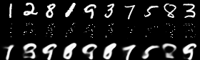

## Image completion task (Inpainting) using Neural Processes

### Environment setup
- Configure parameterse in **config.ini**.
```bash
$ pip install -r requirements.txt
$ python main.py
```
### Output
- in order: target image / provided context points / generated image


#### Model
- Neural Processes
